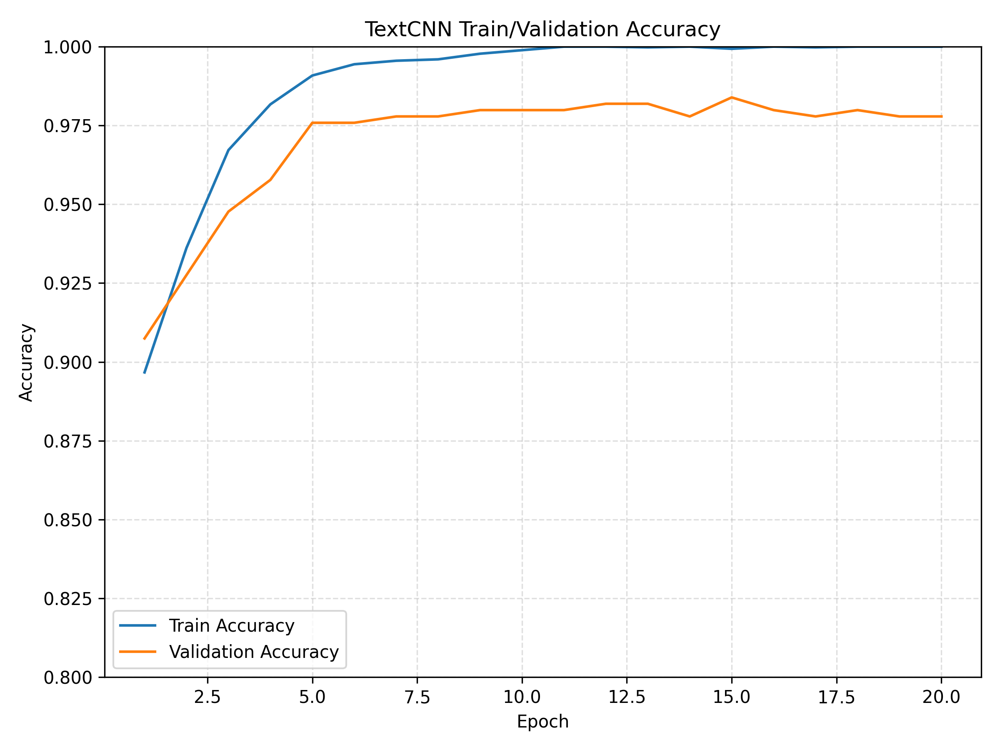

# ATIS Intent Classification

This repository contains our implementation and experiments for the **ATIS Intent Classification** task.  
We compare **TextCNN**, **BiLSTM**, and **BERT (bert-tiny)** models and evaluate their performance under various training configurations, including learning-rate sweeps, regularization, and class-imbalance handling.

---

## 📁 Project Structure

```
ATIS-Intent-Classification/
│
├── src/                    # Model code and training scripts
├── data/                   # Processed ATIS dataset
├── checkpoints/            # Saved model weights
├── reports/
│   └── figures/            # (Deprecated in README — moved to assets/)
├── assets/
│   └── figures/            # Images used in README
└── README.md
```

---

## ⚙️ Requirements

```
python >= 3.10
pytorch >= 2.x
transformers >= 4.x
scikit-learn
matplotlib
numpy
```

Create a conda environment:

```
conda create -n atis python=3.10
conda activate atis
pip install -r requirements.txt
```

---

## 📦 Dataset

We use the intent-only version of the **ATIS dataset**.

| Split | Size |
|-------|------|
| Train | 4481 |
| Valid | 497 |
| Test  | 893 (888 after filtering unseen intents) |

Example label distribution:


---

## 🧠 Models

### **TextCNN**
- Embedding dimension: 100  
- Conv filters: {3, 4, 5} × 100  
- Max-pooling + dropout  
- Fully connected classifier  

### **BiLSTM**
- Embedding dimension: 100  
- Hidden size: 128 × 2 (bidirectional)  
- Last hidden state → dropout → classifier  

### **BERT (bert-tiny)**
- Pretrained transformer  
- Uses hidden [CLS] representation  
- Fine-tuned end-to-end  

---

## 🚀 Training

Example command:

```
python -m src.train_textcnn
python -m src.train_bilstm
python -m src.train_bert
```

All models use:

- Adam optimizer  
- Batch size 32  
- Max length 40 for CNN/LSTM, 64 for BERT  
- Best checkpoint selected by validation accuracy  

---

## 📊 Results

### **Training Curves**

#### TextCNN


#### BiLSTM


#### BERT


---

### **Confusion Matrices**

#### TextCNN


#### BiLSTM


#### BERT


---

## 📈 Summary of Performance

| Model     | Test Acc. |
|-----------|-----------|
| TextCNN   | 0.9392     |
| BiLSTM    | 0.9437     |
| BERT      | **0.9600** |

BERT significantly outperforms CNN/RNN despite being the smallest `bert-tiny` variant.

---

## 📜 Model Card

The full model card is provided in:

```
modelcard.pdf
```

It documents:
- Model architecture  
- Training data  
- Performance metrics  
- Intended usage  
- Failure cases  
- Bias / fairness considerations  

---

## 🖥️ Reproducibility Notes

We include both CPU and GPU training logs in the `results/` directory.
GPU runs were used for the primary model selection, while CPU runs were used
to validate reproducibility and ensure consistent evaluation across hardware.

All reported results correspond to the unified evaluation pipeline.

---

## 📬 Authors

- **Kuntian Tang**
- **Yurui Feng**

This project was completed as part of a course assignment of USC (Fall 2025).

---

## 📄 License

MIT License.
